# Repository Demonstrating the Working of AI based XRAY Image Enhancement Algorithm 
## Funded by [DIGIRAY](http://m.digiray.co.kr/page/page29)

## Description
Image Enhancement algorithm developed for enhancing xray images. Available commercially via [Digiray]().
Key Features : 
* Light-Weight : Real Time performance on Modest Computational Resources
* Unsupervised : No paired training data is needed
* Blind : The methods is scalable to unknown images. (Check the results below)

## Images Source
* The first image 001.jpg comes from [National Sciente Foundation Multimedia Gallery](https://www.nsf.gov/news/mmg/mmg_disp.jsp?med_id=52110)
* Chest XRay images comes from [National Library of Medicine MedPix](https://medpix.nlm.nih.gov/home)
* Panoromic XRay Dental images comes from [Panoramic Dental X-rays With Segmented Mandibles](https://data.mendeley.com/datasets/hxt48yk462/2)

## Some Results
| Original Image       | Enhanced Image |
| -------------        | ------------- |
|     |   |
|     |   |
|     |   |
|     |   |
|     |   |
|     |   |
|     |   |
|     |   |
|     |   |
|     |   |
|     |   |
|     | 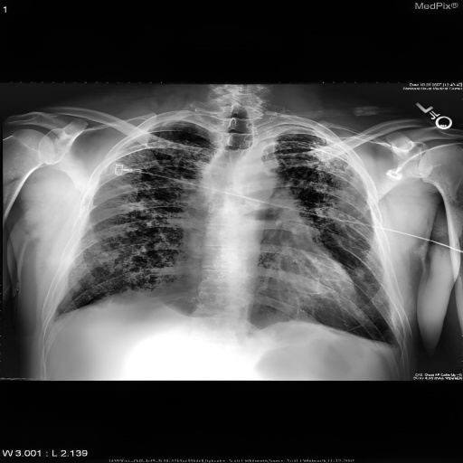  |
|     | 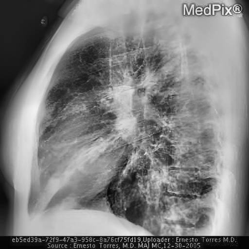  |
|     |   |
|     |   |
|     |   |
|     |   |
|     |   |
|     |   |
|     |   |
|     |   |
|     |   |
|     |   |
|     |   |
|     | 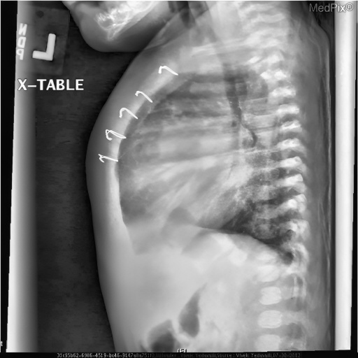  |
|     |   |
|     |   |
| 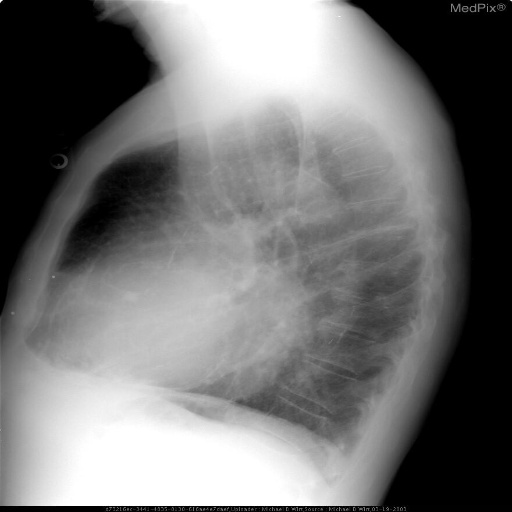    |   |
|     |   |
|     |   |
|     |   |
|     | 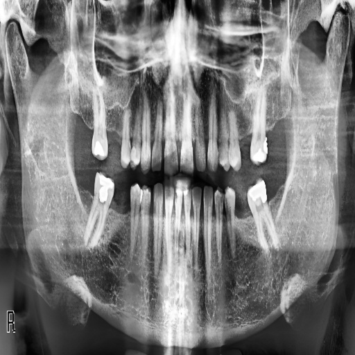  |
|     |   |
|     | 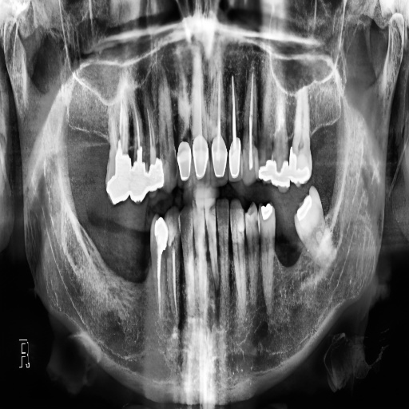  |
|     |   |
|     |   |
|     | 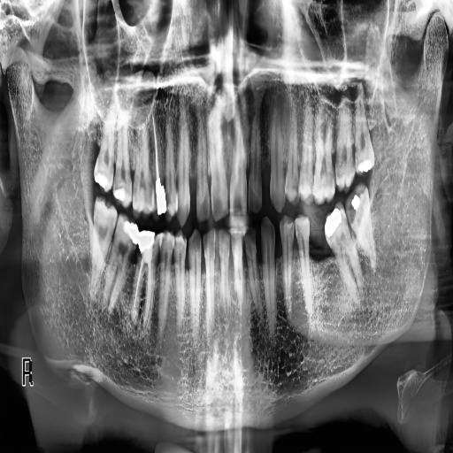  |
|     |   |
|     |   |
|     |   |
|     |   |
|     | 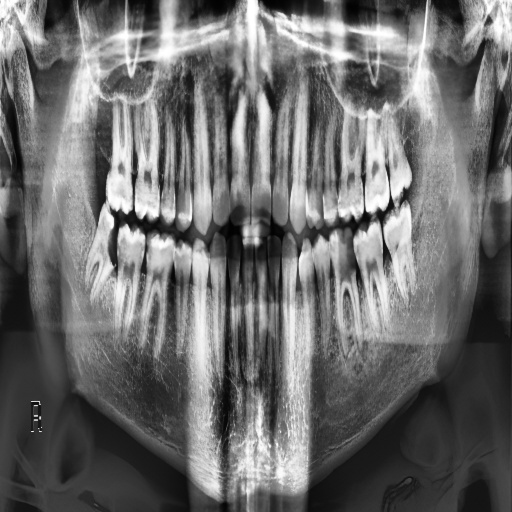  |
|     |   |
|     |   |
|     |   |
|     |   |
|     |   |
|     |   |
|     | 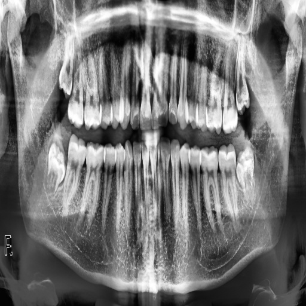  |
|     |   |
| 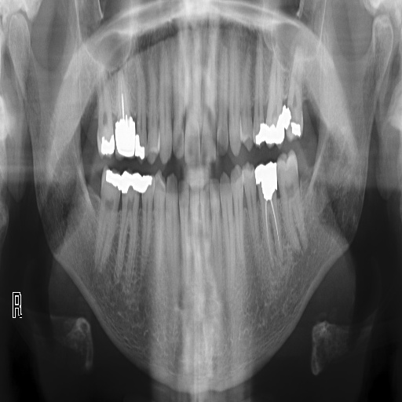    |   |
|     |   |
|     | 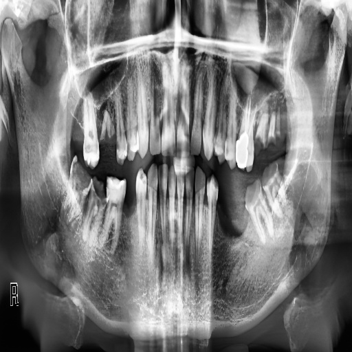  |
|     |   |
|     | 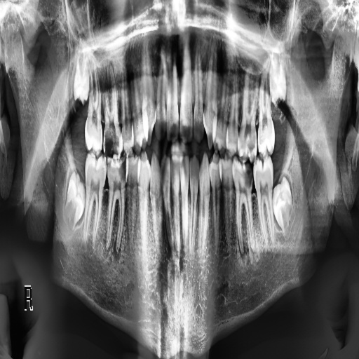  |
|     |   |
|     | 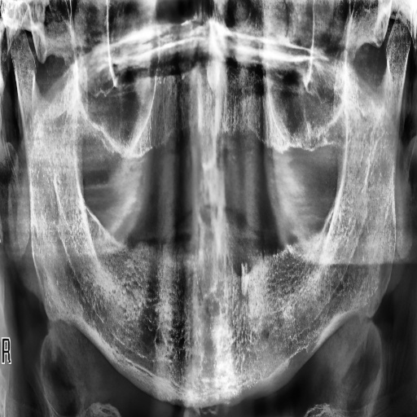  |
|     |   |
|     |   |
|     |   |
|     | 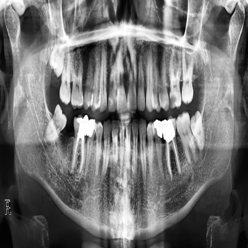  |

## Developers

- [Pranjay Shyam](https://pranjay-dev.github.io/)
- [Antyanta Bangunharcana](https://antabangun.github.io/)
- [Seungho Han](http://msc.kaist.ac.kr/page/Students.php#:~:text=Name%20%3A%ED%95%9C%EC%8A%B9%ED%98%B8%20(Han%2C%20Seungho))
